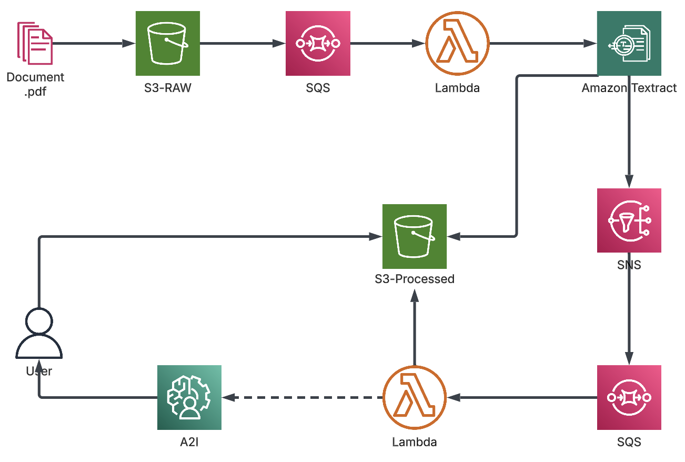

# Document Processor

A serverless document processing pipeline using AWS Textract and Amazon Augmented AI (A2I) for human in the loop validation.

## Architecture

- S3 buckets for raw and processed documents
- Lambda functions for processing
- SQS queues for message handling
- SNS for notifications
- AWS Textract for document analysis
- Amazon Augmented AI (A2I) for human in the loop validation

## Setup

1. Configure AWS credentials for the account that will host the infrastructure
2. Setting up a remote state (Optional): Set up the Terraform backend bucket and dynamo table and edit the terraform/provider.tf file with the correct values
3. Edit the terraform/terraform.tfvars file with the correct values for the region, project name and cognito users (worker emails for the A2I validation).   
**NOTE**:
	- 	It is important to edit the `project_name` in the `terraform.tfvars` file since the S3 buckets carry that name and must be globally unique.  
	- 	It is also important to change the `aws_cognito_users` in the `terraform.tfvars` file to add a valid user and email. These will be the credentials to sign into the A2I validation portal and validate the extracted information.
4. `cd terraform`
5. Run `terraform init` to initialize the Terraform configuration
6. Run `terraform plan` to see the changes that will be applied
7. Run `terraform apply` to create the infrastructure.
8. Test the system: 
   - Upload an invoice document (extension .pdf) to the `{project-name}-raw-documents` S3 bucket. A test invoice can be found in the `docs` folder.
   - Check the `{project-name}-processed-documents` S3 bucket for the results
   - Go to AWS SageMaker AI > Ground Truth > Labeling workforces > Private and find the Labeling portal sign-in URL.  
   - Use the sign in URL to sign in to the Worker label portal. The credentials will be sent in an email to the cognito users you added in the terraform.tfvars file
   - Once signed in, you will be able to see the documents that need validation
   - Validate the documents and click on the `Submit` button
   - Check the `{project-name}-processed-documents` S3 bucket for the results
9. Run `terraform destroy` to destroy the infrastructure when you're done

